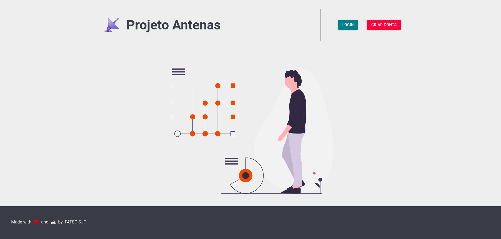
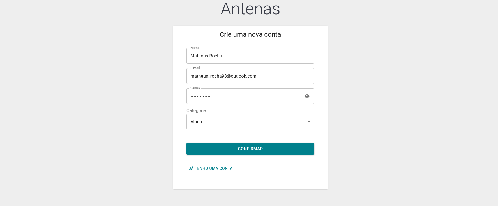
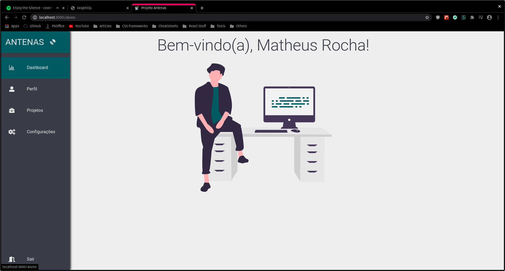
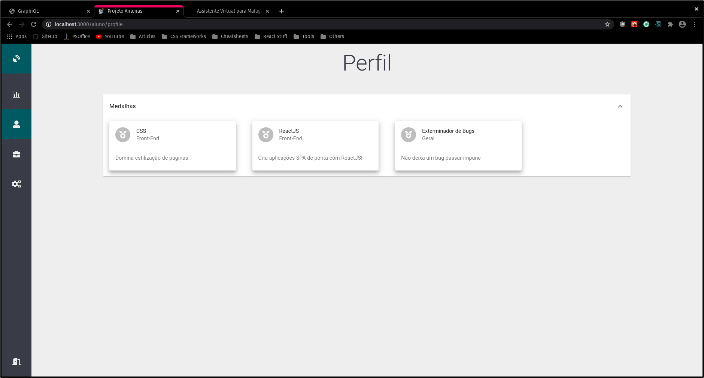
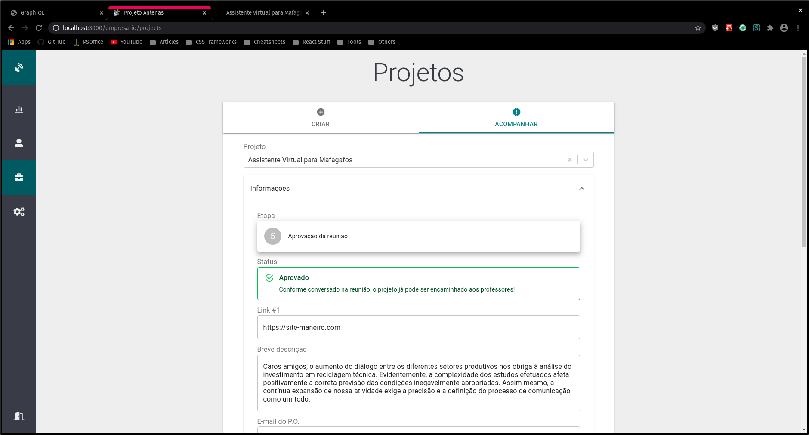

# Projeto Antenas (Front-End)


[](http://commitizen.github.io/cz-cli/)


Padrões de Projetos - 4º semestre de BD

Professor: Giuliano Bertoti

Equipe:

- Lucas Barcelos - 1460281923024
- Matheus Rocha da Silva - 1460281823034

## 🚚 Entregas

### 1ª quinzena de maio

- Criação do menu.
- Criação das telas de login e cadastro.
- Integração com o back-end.

### 2ª quinzena de maio

- Separação das rotas por tipo de usuário.
- Criação da landing page.

### 1ª quinzena de junho

- Criação de projeto a partir do empresário.
- Criação do componente ProjectView para exibir os dados do projeto.
- Criação de medalhas a partir do professor.
- Atribuição de medalhas.

### 2ª quinzena de junho

- Refatoração do ProjectView para permitir edição.
- Aprovação do CADI.
- Preenchimento de mais campos pelo empresário.

### 1ª quinzena de julho

- Preenchimento de reunião pelo empresário.
- Vinculação de alunos ao projeto a partir do professor.
- Envio de entregas pelo aluno.

## 📸 Capturas de tela


Página inicial (landing page)


Criação de conta


Dashboard do aluno


Página de medalhas


Acompanhamento de projeto

## ⚙️ Como executar a aplicação

Antes de tudo, instale as seguintes ferramentas:

1. [NodeJS](https://nodejs.org/en/) (se você utiliza Linux ou Mac, recomendamos o [NVM](https://github.com/nvm-sh/nvm))
2. [Yarn](https://yarnpkg.com/getting-started/install)

Clone o projeto no diretório de sua preferência:

```bash
git clone https://github.com/mrocha98/projeto-antenas-react
```

Para executar o back-end, consulte o repositório [Projeto Antenas Node](https://github.com/mrocha98/antenas-back).

Execute esses comandos dentro da pasta do projeto:

```bash
yarn install
yarn start
```

Seu navegador padrão abrirá uma nova guia com o projeto em ambiente de desenvolvimento!

## 🙌 Como contribuir com o projeto

Sempre abra uma branch à partir da developer.

Faça um merge local da sua branch de feature na developer antes de abrir um Pull Request (`git pull origin developer`).

Nós utilizamos algumas ferramentas de padronização para commit, basta que você execute `git commit` (sem o -m), seu terminal abrirá um menu de opções, escolha a categoria do commit e faça um breve comentário das suas mudanças.

Em caso de dúvidas, assista esse vídeo:

[](https://www.youtube.com/watch?v=erInHkjxkL8)

## 📔 Trello

Durante o desenvolvimento do projeto, criamos um quadro no Trello. Confira no link:

<https://trello.com/b/hubCQsG0/projeto-antenas-c-stack-js>

## 📜 Licença

Este projeto foi criado sob a licença MIT.

## 🤔 Extras

Caso este projeto seja continuado por futuros alunos, deixo aqui alguns tópicos que podem ajudar:

Eu criei um tutorial de React no Medium onde é desenvolvida uma pequena aplicação que busca dados de uma API pública.
Confira no Link:

<https://medium.com/@mrocha98/crie-seu-primeiro-projeto-com-reactjs-16e340dfde1a>

Se sentir muita dificuldade em acompanhar, sugiro revisar alguns tópicos de Javascript puro. Essa playlist é excelente:

[](https://www.youtube.com/playlist?list=PL9rc_FjKlX39T78CUANwmdta_d1CgUtMt)

Algumas bibliotecas que não foram utilizadas no projeto, mas que enxugariam muito código, além de dar mais produtividade, são:
- [SWR](https://swr.vercel.app/)
- [ahooks](https://ahooks.js.org/)
- [Apollo Graphql](https://www.apollographql.com/docs/react/)
